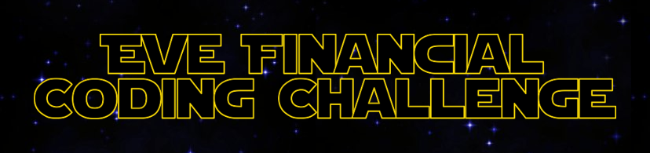

# Join Eve Financial - the coding challenge

## Introduction

Hi! If you're reading this then it's because you're in the interview process with us at Eve Financial and have been invited to complete the coding challenge as a **Frontend Engineer**. Congratulations! 🎉

This coding challenge is designed to assess your ability to write code while giving you the freedom to express yourself and show off what you consider to be best practices.

## Setup

This repository contains the skeleton of a Angular app in TypeScript with [PrimeNG](https://www.primefaces.org/primeng/button) as a component library, to which you will add functionality. The code here was built for node version 14.

The first step is to run `npm i` to install the required dependencies.

A handful of scripts are provided:

`npm run build` will build the application

`npm run start` will start the application 

`npm run test` will run the tests.

## The scenario
Create a Star Wars wikipedia web app that is specifically about planets in the Star Wars universe.

You are free to make any design decision you think is necessary with the focus on user experience and design.

### Requirements
This challenge is providing you with a lot of freedom and creativity as long as a few base requirements are met:
- A user must be presented with a list of planets (Planets are provided in `src/app/star-wars/planets.json`).
    - The planets should be sorted alphabetical by the planet name.
- A user should be able to click on a planet and then view the details of that planet.
- BONUS: Write unit tests to ensure that planets sort alphabetically by the planet name.

# Tips

The functional requirements here should probably take no longer than a couple of hours to implement. The standard you should be aiming for is something you would submit as a pull request for a production ready feature. Keep in mind, quality over quantity. If you don't get to a complete solution, that's fine as long as you can highlight your approach and showcase quality code.

# Assessment
Overall quality over feature-completeness. The challenge is intentionally kept very open to provide you with enough freedom to make your own decisions and creatitivy. If you don't get to work on everything, outline what the next steps would look like and how you'd approach it. 

We will assess your solution based on following criteria:

- **Architecture**
Design decisions, clean separation of concerns?

- **Clarity**
Comments, documentation, naming conventions

- **Correctness**
Does it work as intended

- **Code Quality**
Any red flags? OOP vs functional, SOLID, consistent code

- **Security**
Any vulnerabilities e.g. input validations, error handling

- **Testing (BONUS)**
Unit tests, do they exist, do they run?

- ~Scalability
How will it perform with 1 req/s, 10 req/s, 100 req/s? 

- ~Product readiness
Can it be used in production? What might be missing?

# Submission
Once you're comfortable with sharing your code provide either a link to your repository or package it up into a `zip` file and send it to `jimmy@eve.co`.

# FAQ
I have not been invited for a coding challenge, can I still submit?
> Absolutely! We are looking for people who are just as passionate about building products for a global audience as we are. Submit your solution and we'll be in touch! Chances are you'll be able to go through our interview process and possibly join Eve Financial! 

I've spent too much time and can't complete the challenge, will I lose the opportunity to get a job?
> As a reminder, quality over quantity. If you don't get to a complete solution, that's fine as long as you can highlight your approach and showcase quality code. Pick one endpoint and see if you can get it to work.

I'm new to Angular, can I use React or something else instead?
> We are looking for people who are familiar with Angular and have a solid understanding of the concepts. The boilerplate provided should get you started right away without having to worry about an initial setup. If you're new to Angular take it as a great opportunity to learn more and focus only on a small portion of the challenge. At the end of the day you'll be using Angular on a daily basis once you join Eve Financial.

